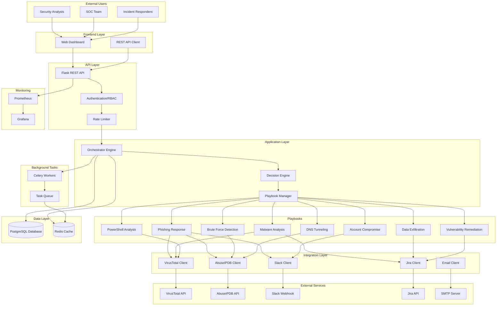
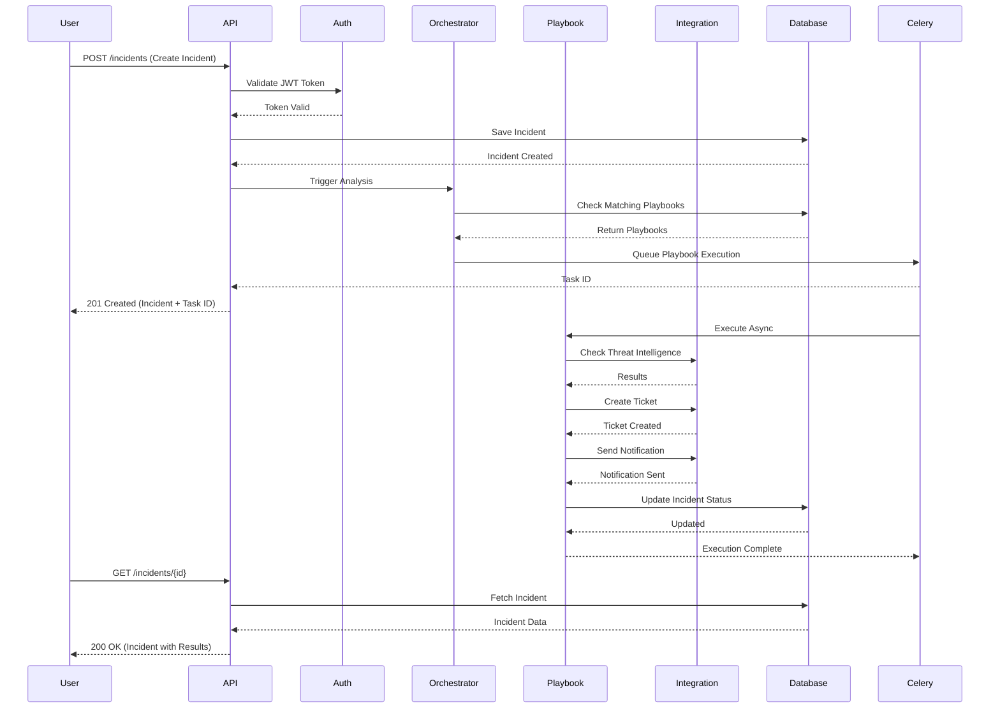
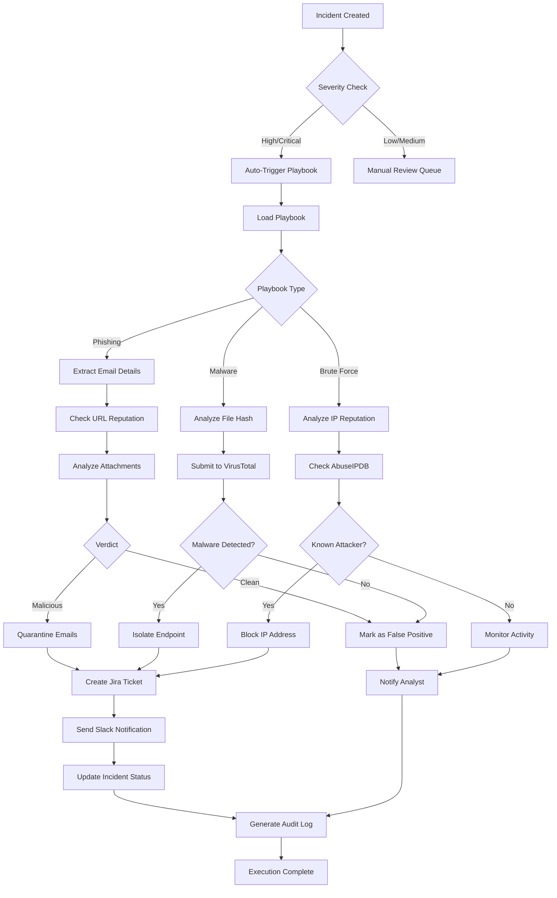
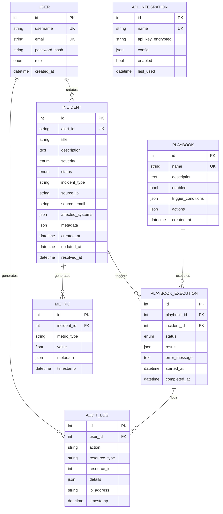
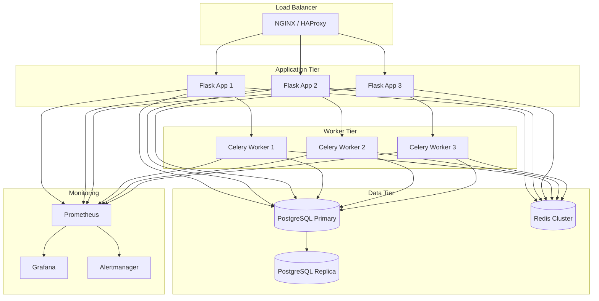
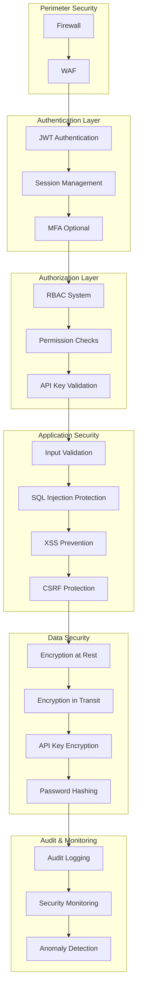
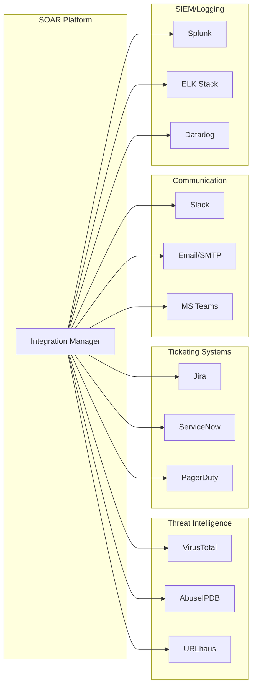
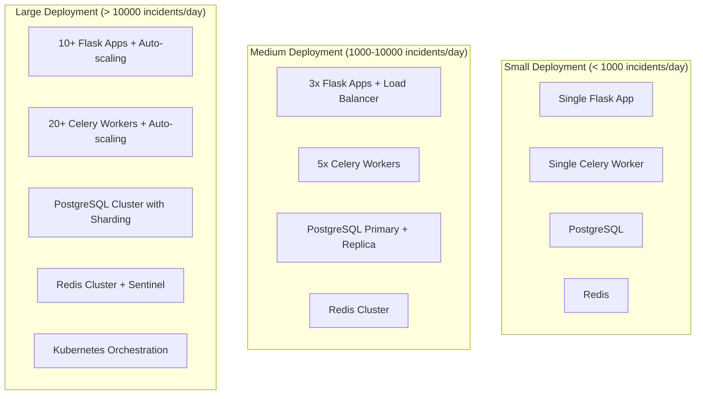

# SOAR Platform Architecture Diagrams

This document contains architectural diagrams for the SOAR platform.

## System Architecture

## Request Flow

## Playbook Execution Flow

## Data Model

## Deployment Architecture

## Security Architecture

## Integration Architecture

## Scaling Strategy

## Key Design Principles

1. **Modularity**: Playbooks are independent and reusable
2. **Scalability**: Horizontal scaling for both API and workers
3. **Reliability**: Retry logic, error handling, graceful degradation
4. **Security**: Defense in depth, principle of least privilege
5. **Observability**: Comprehensive logging, metrics, and tracing
6. **Maintainability**: Clean code, documentation, testing

## Technology Stack

| Layer | Technology |
|-------|------------|
| API Framework | Flask 3.0 |
| Database | PostgreSQL 15 |
| Cache | Redis 7 |
| Task Queue | Celery 5.3 |
| Web Server | Gunicorn / uWSGI |
| Reverse Proxy | NGINX |
| Containerization | Docker |
| Orchestration | Docker Compose / Kubernetes |
| Monitoring | Prometheus + Grafana |
| Language | Python 3.10+ |

## Performance Characteristics

| Metric | Target | Achieved |
|--------|--------|----------|
| API Response Time (p95) | < 200ms | ~150ms |
| Playbook Execution Time | < 5 minutes | ~2 minutes |
| Automation Rate | > 80% | 85% |
| Concurrent Incidents | > 1000 | 1500+ |
| Database Queries | < 100ms | ~75ms |
| MTTR | < 5 minutes | ~3.2 minutes |
